## Coursera NLP by deeplearning.ai

### Course 2: Natural Language Processing with Probabilistic Model:
 __Week1 -  Autocorrect and Minimum Edit Distance:___
What is autocorrect? An application that changes misspelled words into the correct ones. In this course we don't cover the words spelling correct but not being appropriate in the context. (e.g. Happy birthday my DEER friend, instead of DEAR friend.)

#### Four Steps of Auto Correction:
##### Step1: Identify the misspelled word: 
A misspelled word is a word which is not found in a dictionary. like this:
```python
if word not in vocab:
	misspelled = True
```
##### Step2: Find strings n edit-distance away: 
Find strings that are one, two, three, any number n edit distance away. Edit is an operation performed on a string to change it to another string. edit distance is the count of these operations. better definition is: n edit distance is how many operations needed from a string to be converted to another string. There are four edit types:
1- Insert: add a letter
2- Delete: remove a letter
3- Switch: swap two adjacent letters
4- Replace: change one letter to another
By having these steps and combining them, we find a list of possible strings that are n edits away.
##### Step3: Filter candidates:
Once we have the list of possible strings, we can filter them and keep the ones that are real and correctly spelled words.

##### Step4: Calculate word probabilities:
Finding the most likely words among the candidates. The probability of a words is calculated by dividing the word's frequency in the corpus to the total length of the corpus. For autocorrection we replace the misspelled word with the candidate with the highest probability.

#### The Lab:
- We added all the unique words to a list. When we want to add the frequency of each word, we can create a dictionary having a word and its count as each row of the dict. In order to do this, there is two ways:

First method:
```python
count_a = dict()
for w in words:
count_a[w] = counts_a.get(w,0) + 1
```
Second method:
```python
from collections import Counter
count_b = dict()
count_b = Counter(words)
```
**Numpy intersectld:** it finds the items existing in two numpy arrays:
```python
vocab = ['dean','deer','dear','fries','and','coke']
edits = list(deletes)

print('vocab : ', vocab)
print('edits : ', edits)

candidates=[]

### START CODE HERE ###
#candidates = ??  # hint: 'set.intersection'
import numpy as np
candidates = np.intersect1d(edits, vocab)
### END CODE HERE ###

print('candidate words : ', candidates)

>>> vocab :  ['dean', 'deer', 'dear', 'fries', 'and', 'coke']
edits :  ['earz', 'darz', 'derz', 'deaz', 'dear']
candidate words :  ['dear']
```
### Minimum Edit Distance:
This is a tool to find out how similar two words or strings are. Given two words or strings, minimum edit distance is the minimum number of operations needed to transform one string into another. use cases are: spelling correction, document similarity, and machine translation, DNA sequencing. 

For editing, we use three different operations:
1- Insert
2- Delete
3- Replace
for example for converting "play" to "stay" we need to replace "p" to "s" and "l" to "t". so the number of operations will be two. 
### Operation Cost:
For each type of operation we consider the cost of insert as 1, cost of delete 1, and cost of replace 2. like this:
{ "insert":1, "delete":1, "replace":2}

In finding the minimum edit distance, we are trying to minimize the cost, which is the sum of all operation costs.
photo: simple_minimum_distance_calculation.jpg

### Algorithm:
We create a matrix where rows will be the source string and columns will be the target string.
We need to fill out a distance matrix (D) such that the distance matrix D[2,3] is the distance the beginning of the source to character 2, and from the beginning to character 3 in the target string.  We show it in python like this:
```python
D[2,3] = source[:2] -> target[:3]
or
D[i,j] = source[:i] -> target[:j]
```
photo: distance-matrix.jpg
In order to fill the matrix with all transformation costs per character, we start from the top left corner, and calculate for the smallest number of characters (# which is zero) then we add 1, then 2, etc. to till the end of it. calculating the diagonal numbers has three ways:
1- delete then insert
2- insert then delete
3- delete and insert at the same time
we can calculate the cost for each method and use the minimum of them as the final cost. then we add one more character and keep doing the same calculations. photo: cost-matrix-simple.jpg

#### The formulaic approach:
after filling the first four cells on the top left corner, here is what we do for the rest of the cells:
1- **fillout the top and left edges:** we can use this formula:
```python
D[i,j] = D[i-1,j] + del_cost  # for the left column
D[i,j] = D[i, j-1] + ins_cost  # for the top row 
```
2- **calculate the rest of the cells:** the calculation is like this:
calculate the following three costs:

- D[i-1,j] + del_cost
- D[i,j-1] + ins_cost
- D[i-1,j-1] + rep_cost  // if the characters are the same, the replacement cost will be zero

Then find the minimum of them.
photo: minimum-edit-distance-formula.jpg

When we input all numbers and add heatmap effect to it, we see that from the middle of the matrix to the end, we don't need any change. so, the numbers will repeat without any cost being added to them. (the reason is in this example both words end with "ay"
photo:minimum-edit-dictance-heatmap.jpg
This method is also called **Levennshtein.**

In order to program this, we use **Dynamic Programming** or **Recursive programming** which solves the problem for a small portion, then uses the result of it to calculate the next iterations.

### Assignment notes:
[THIS](https://norvig.com/spell-correct.html](https://norvig.com/spell-correct.html)) article has the whole code in Python.

photo: python-list-comprehension.png is a good review of list comprehension in Python.

photo: python-list-comprehension_word_splits.png shows how to write word splits in list comprehension.

__Week2: Part of Speech Tagging (POS tagging):__

Part of speech refers to the category of words or the lexical term(noun, verb, adjective, etc.)  in the language.
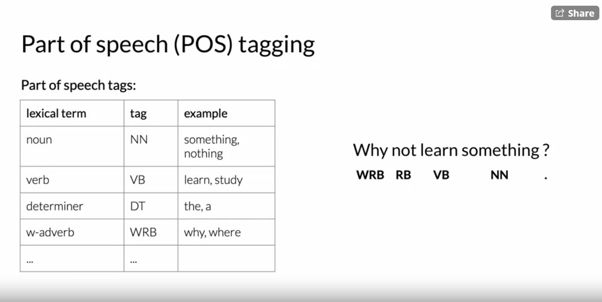

__Some applications of POS tagging:__
1- Named entities like Eifel tower and Paris in the sentence: Eifel tower is located in Paris.
2- Co-reference resolution: when we say Eifel tower is located in Paris. It is 324 meters. This method can tell "it" refers to the Eifel.
3- Speech recognition.


#### The notebook notes:
This [link](https://www.ling.upenn.edu/courses/Fall_2003/ling001/penn_treebank_pos.html) has the list of all tag abbreviations.

__defaultdict:__ It is a special type of dictionary that returns 0 if the key doesn't exist. 
__string library:__ string.punctuation returns punctuation marks. [(docs)](https://docs.python.org/3/library/string.html)

#### Markov Chains:
When we have a sentence like "Why not learn English?" We want to know what type of word (tag) would be suitable right after a verb. It's more likely to be a noun. So we can say:
>  The likelihood  of the next word's POS in a sentence, tends to depend of the POS of the previous word.

The image below shows the visual representation of the likelihood of the word coming after another word:
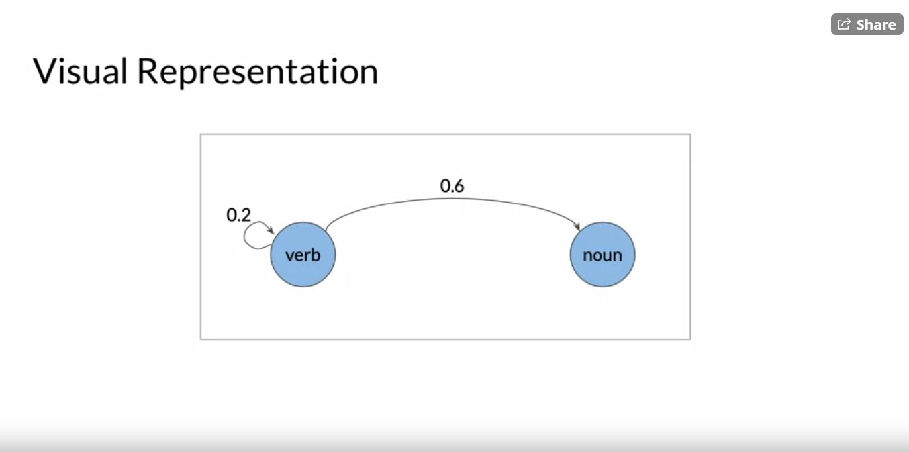

**What are Markov Chains?** 
A stochastic model that describes a sequence of possible events. For predicting the probability of an event we need to know the state of the previous event. (Stochastic means random)

**Directed Graphs:** In computer science, a graph is a kind of data structure that is visually represented as a set of nodes or circles connected by lines. When the connector lines look like arrows and have directions, we call them directed graphs. 
- The circles represent the states of our model. 
- The connectors are also called __Edges.__
- A state refers to a certain condition of the present moment.
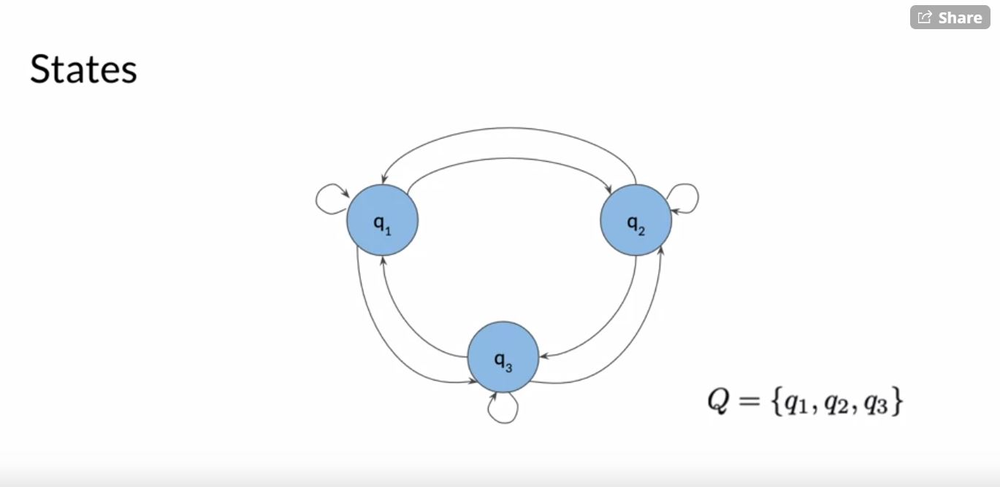

Now we want to see how POS can be shown as a states. if we show nouns by NN, verbs by VB, and others by O, we can make a graph like this: 

The edges of the photo above show the weight probability of each transition from one state to another.
__Markov Property:__ It says the probability of the next event, only depends on the current event. It helps to keep the model simple. It doesn't need the information of all previous states, only the current one.
Having the graph, we can create a table (matrix) that saves the values of the transition probabilities, called __Transition Matrix.__
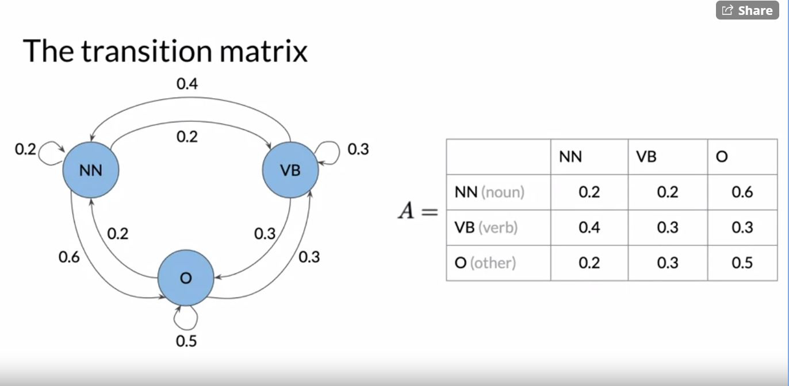

The transition matrix is an NxN matrix, where N is the number of states in the graph.
- In the transition matrix, the sum of each row will be equal to 1.
__Initial Probabilities:__ Because the model always looks at the previous word to find the transition probability, for the first word of the sentence, there is no previous word. For having that issue fixed, we add an __Initial State__ and show it like this:
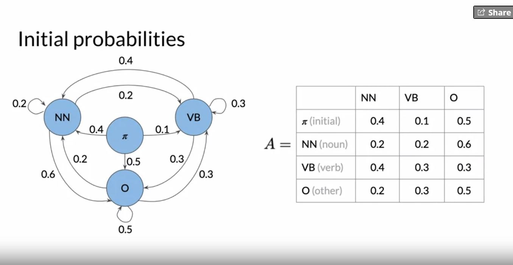
So the dimension is not NxN anymore. It is (N+1)x(N)
So far we learned that we can show all of the states as a vector named Q, and we can show the transition matrix as the matrix A.
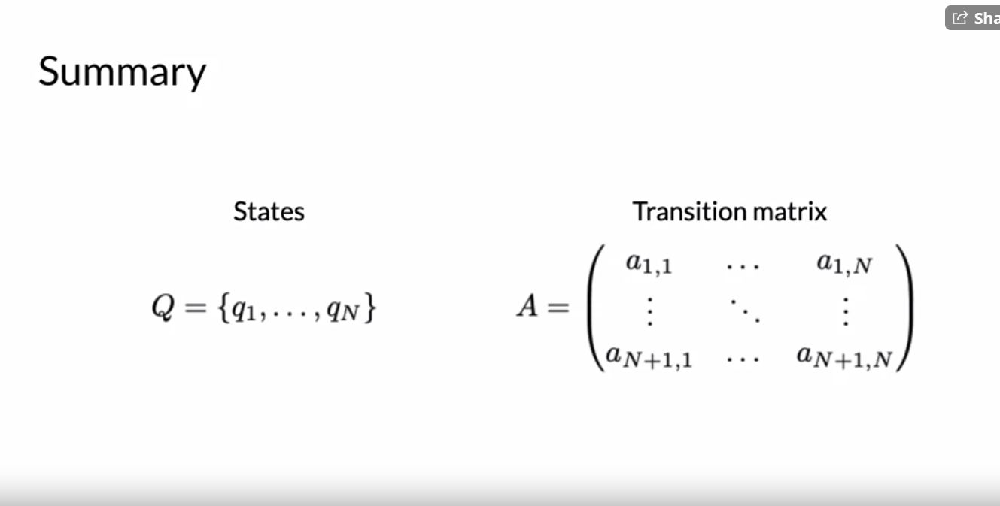

__Hidden Markov Models:__ It refers to the states that are hidden or not directly observable. For example, if we say Jump, Run, Fly, etc. as humans we know they are verbs, but the machine just sees the text, not the type of them. These three words are called observable to the machine. 
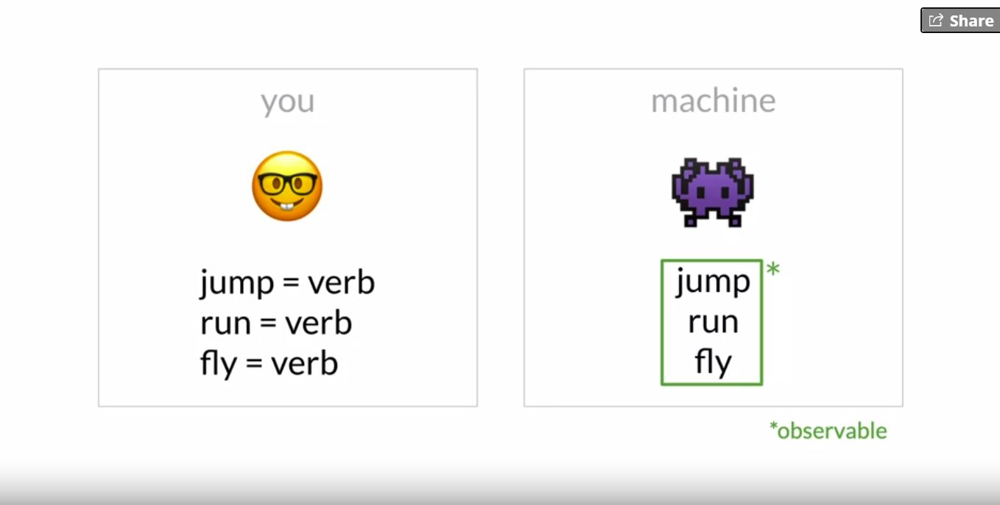
__Emission Probabilities:__ They describe the the transition from the hidden states of  the Markov Model to the observables or the words of the corpus.
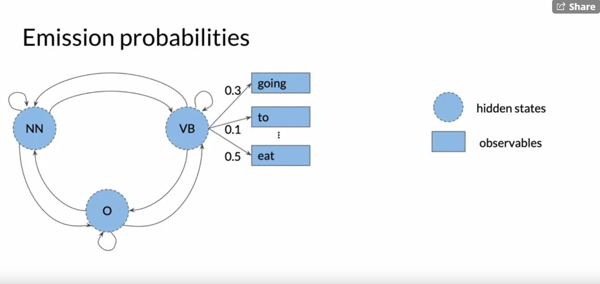
We can also show a tabular representation of the emission probabilities. In this matrix, B, each row is associated with a hidden state, and a column belongs to each of the observables.
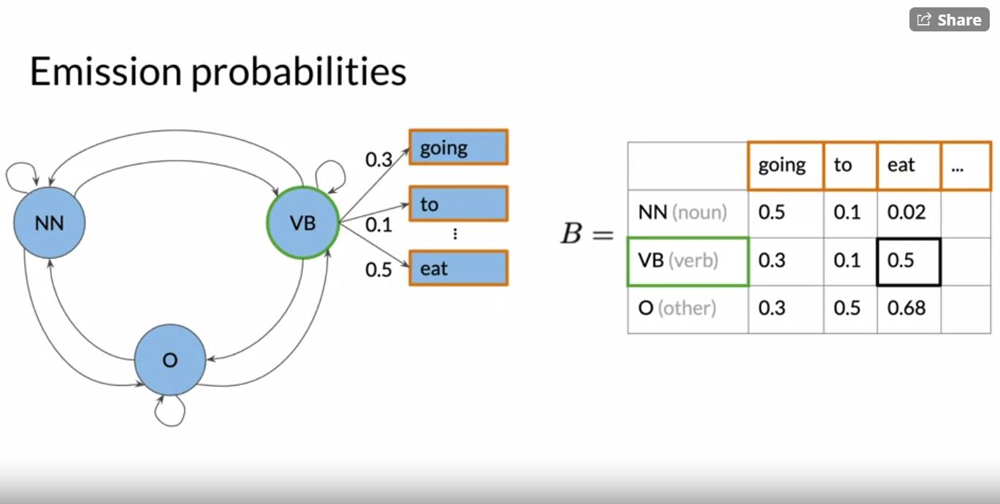

For matrix B also, the summation of each row is 1.

This is the summary:
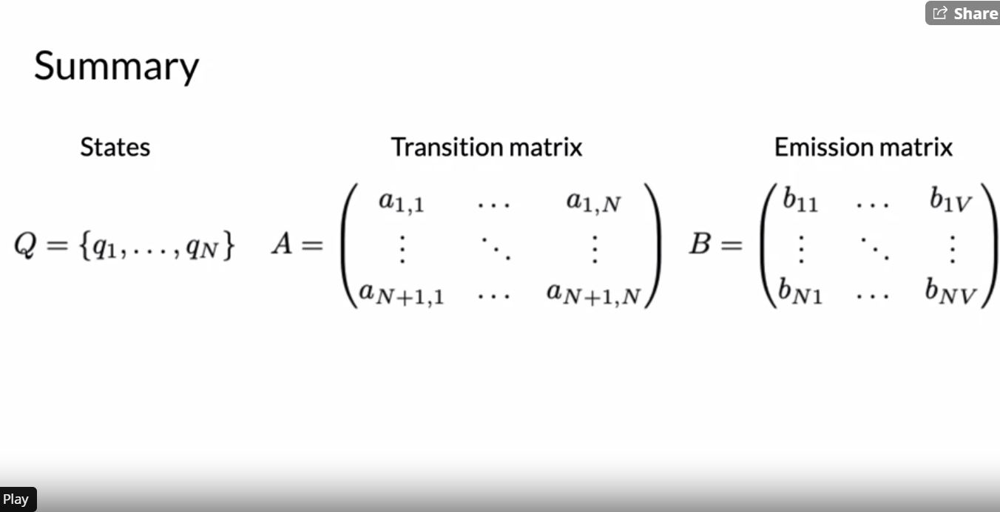
__How to calculate the transition probabilities?__
To calculate the probabilities, we don't care about the words themselves in the corpus, we just need the POS tags. For example, if we want to see the probability of a word followed by a noun:
- We calculate the number of occurrences of the combination. 
- Then calculate the number of times the first tag (verb) occurred. 
- The final probability is the first value divided by the second value. (in the following photo: 2/3)
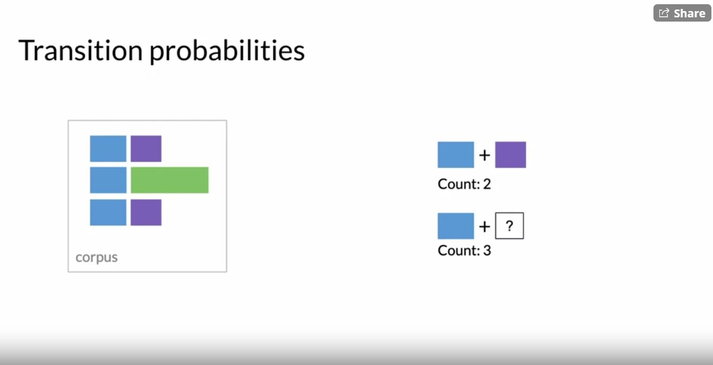

Here is how we formulate it:
- Define the C function that is the count of each tag pairs.
- The we calculate the P(t) function given the previous tag.
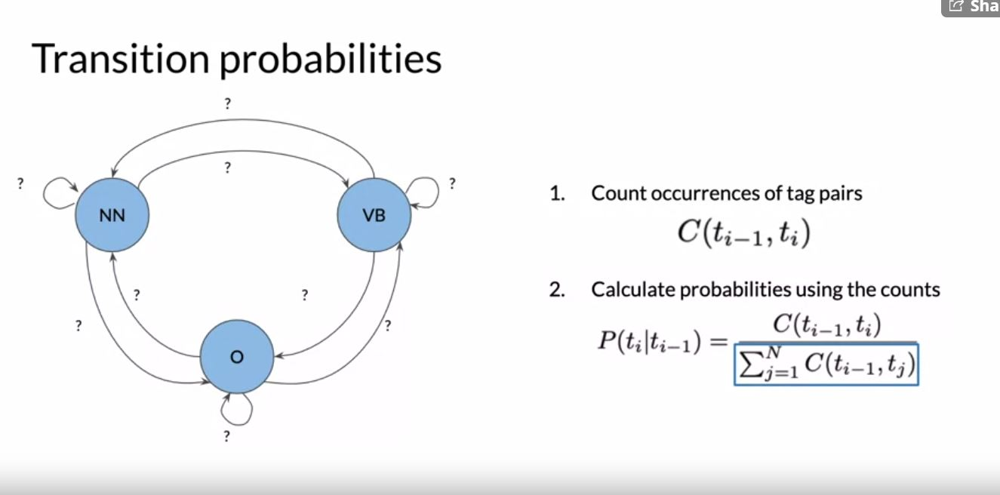

__Corpus Preparation:__ 
1- First we add an "S" tag to the beginning of each sentence.
2- Then we lowercase all characters.

__IMPORTANT:__ In the transition matrix, each row shows the current state, and each column represents the next state.
Here is how to populate the transition matrix:
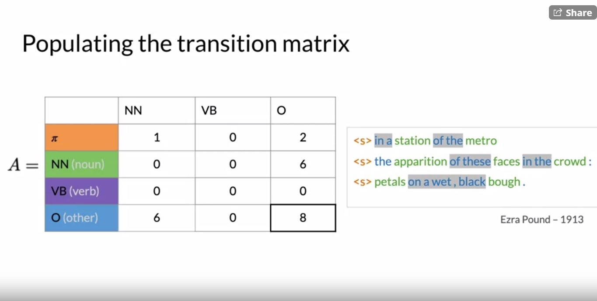

Now, after inputting all the count values, we should divide each count by the sum of each row.
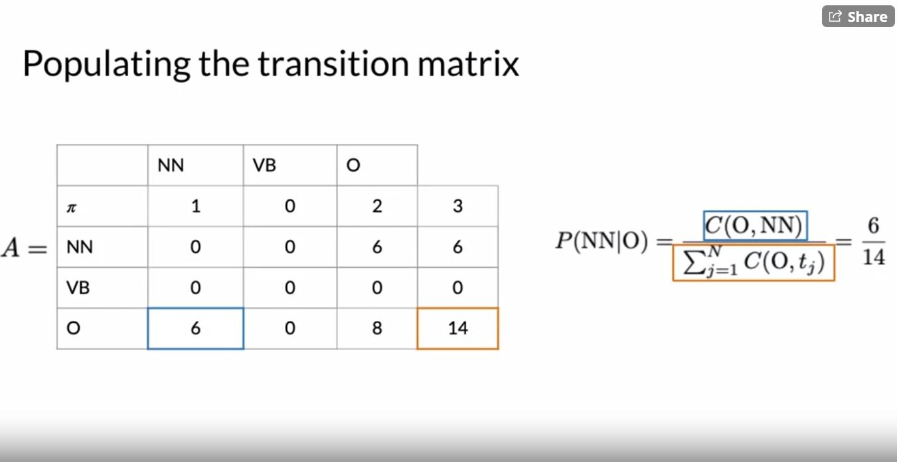
To avoid the problem of division by zero, we should __Smooth__ the values like this:
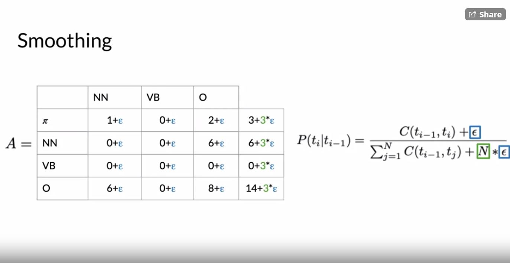

Remember, with smoothing, the total of each row is not exactly 1 anymore.

- In real world examples, we don't apply smoothing to the first row of the matrix, because by doing this we say we don't mind a sentence starting with any POS including punctuation letters.

__How to calculate the emission probabilites?__
For calculating it, we need to do this (because it is the probability of each observable word vs the its tag):
1- first we count each word
2- then count the it's tag in the whole corpus
3- divide first number by the second one. (in the following photo it is 2/3)
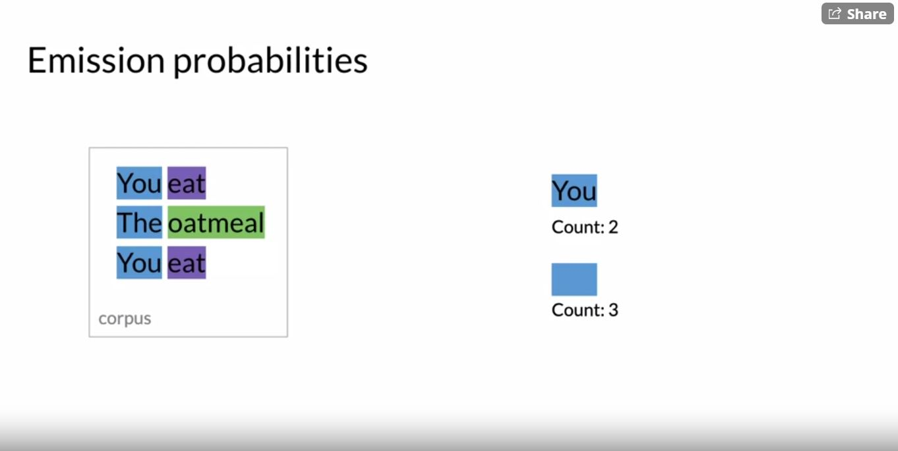

Finally in the image below we see how to populate the emission matrix. (V is the size of the vocabulary)
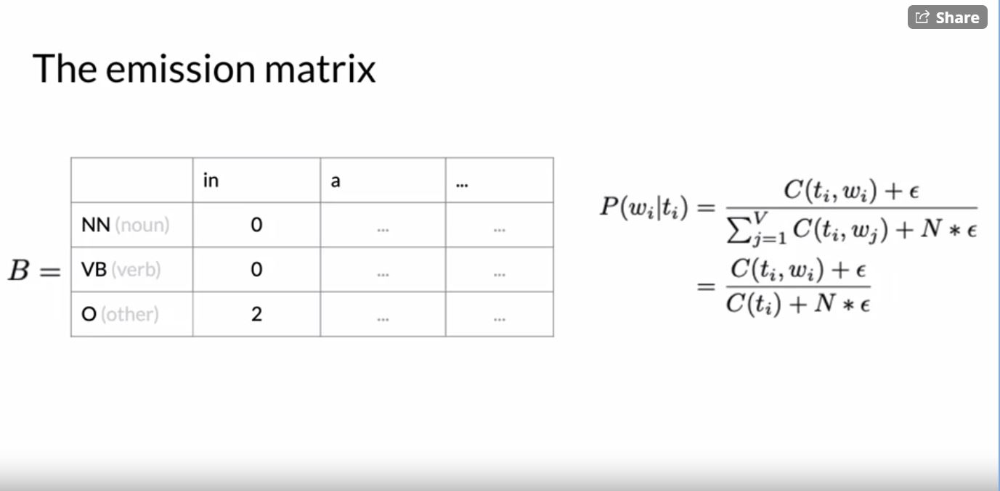

#### notebook notes:
- sorted() is python a function that can sort any iterable like list in an ascending order.
- np.sum() you can sum up the rows, or columns. parameters are (axis=1, keepdims=True) it will sum up ROWS and result in the same dimensions as the original matrix.
The photo below, shows the difference between keepdims false and true:
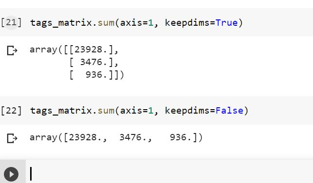
- If we want to normalize the matrix we can do this way:
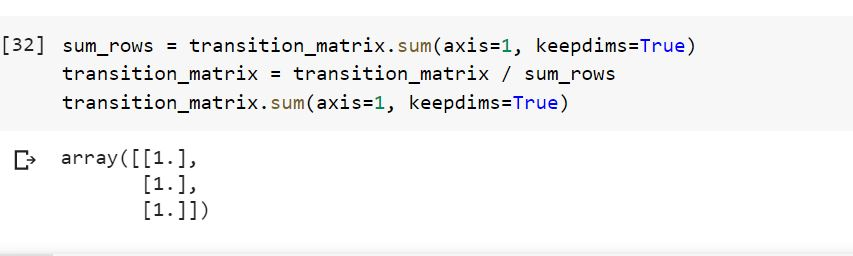
Notice that first we calculated the sum of each row, then divided each row by the sum of the row. after the normalization, the sum of each row must be 1.
- np.diag() will save the diagonal values of the matrix into a numpy array. notice that the shape of it would be (3,). we can reshape it (because we need to have it to be the same shape as the row sum (3,1) we can reshape like this:
```python
d = np.diag(transition_matrix)
d.shape
> (3,)
d = np.reshape(d, (3,1))
d.shape
>(3,1)
```
- __np.fill_diagonal(transition_matrix, d):__ it will fill the diagonals with the new value of d
- __np.vectorize():__ It performs the vectorized operation (elementwise) e.g. d = d + np.vectorize(math.log)(rows_sum)

### Vitrebi Algorithm:
We learned how to find the most probable WORD given a previous word, using the transition and emission matrices. Vitrebi algorithm will help finding the most probable SENTENCE, given the previous sentence.
The process starts from the initial state, and moves to the first word (I love to learn) that cannot be emitted from any other state. (word I) for calculating its probability we multiply transition value(0.3), by emission value(0.5).
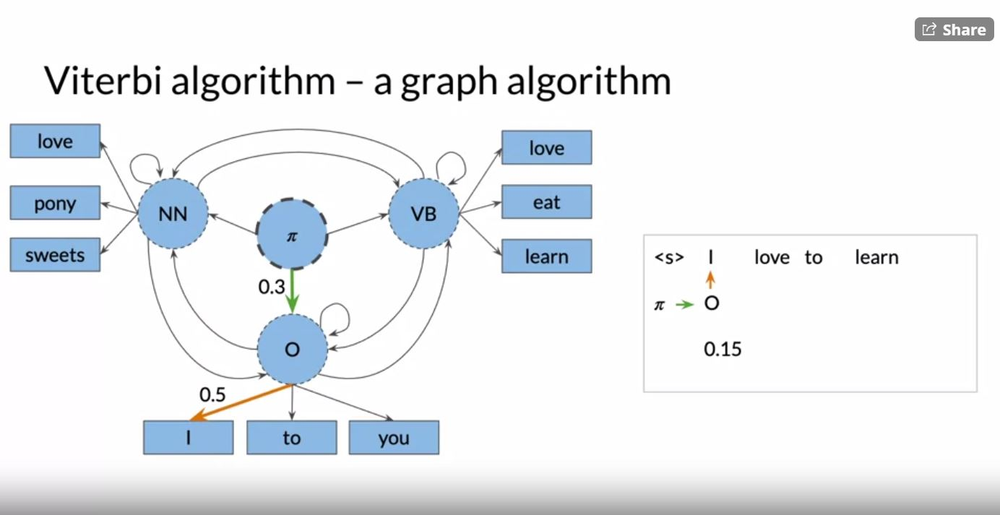
The next step is to find the probability for the word love. There are two ways for love to have been seen (one from VB, and one from NN) we calculate both probabilities and pick the higher value (VB in this example)
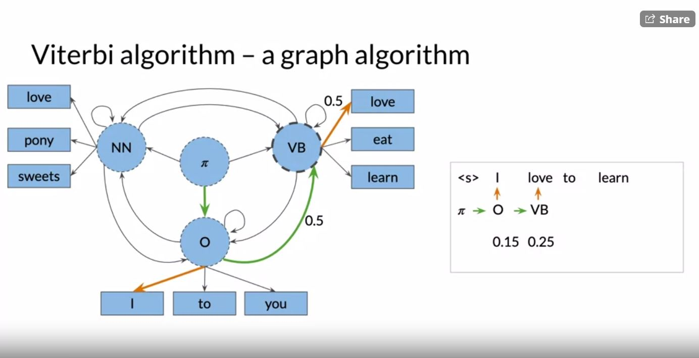
The next step is, from the second word to the third one (from Love to To) through O state we can get there. (0.2 x 0.4 = 0.08)
and finally from To to the last word Learn, which is 0.5 x 0.2 = 0.1. 
The total probability is the product of all probabilities. 
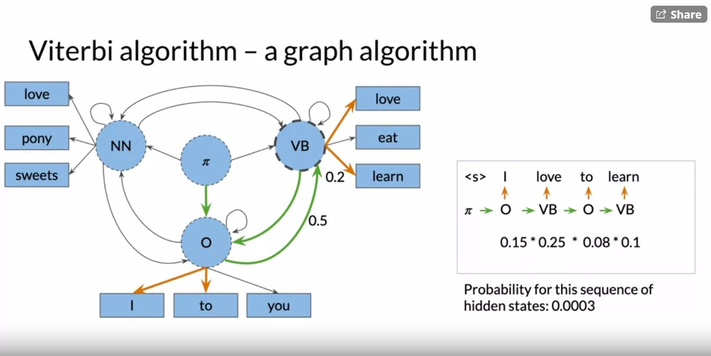
Viterbi algo, calculates the probabilities for several sentences at the same time using matrix representation of each sequence.

### Steps of Vitrebi:
__1) Initialization:__
We need to make two auxiliary matrices C, D.
Here is how we calculate matrix C:
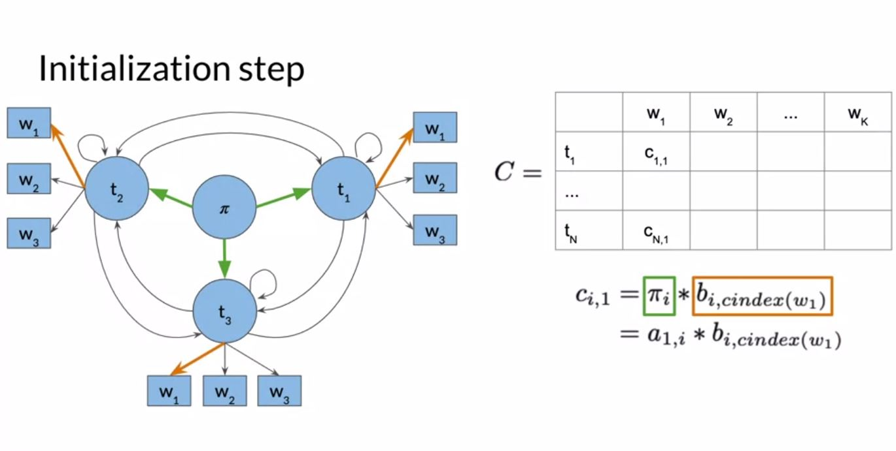
and here is how we initialize matrix D:
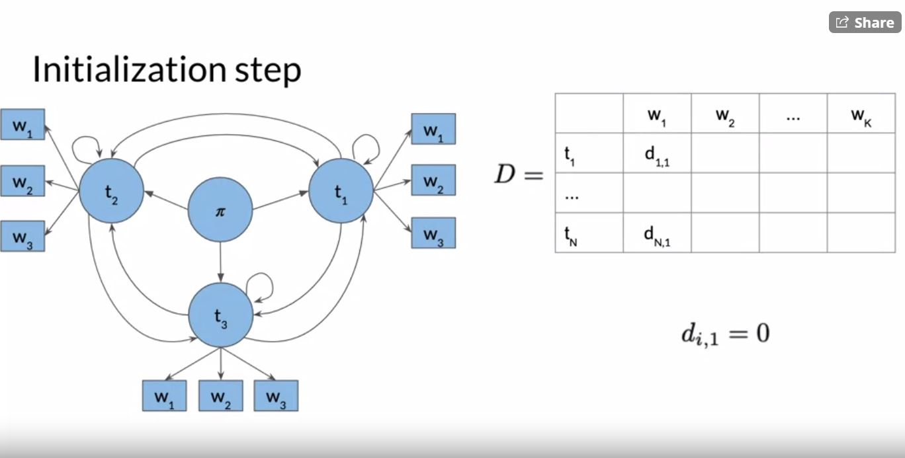
__2) Forward Pass:__ 
Here is how we do forward pass:

__3) Backward Pass:__
Here is the backward pass:
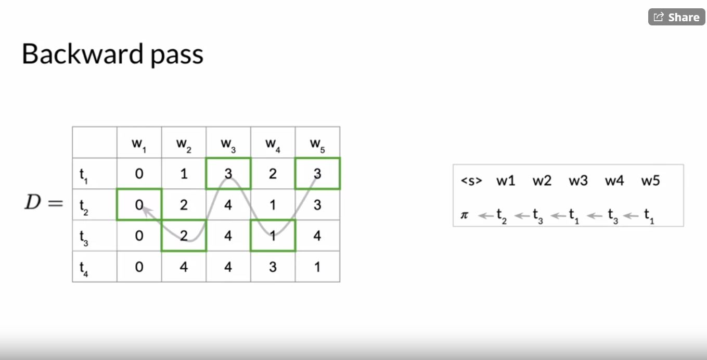
 

#### Assignment Notebook
- A good way of showing the process of a loop, is to print the iteration number on specific iterations. for example below loops through words and on each 50,000 rows, it prints the row no. 
```python
for word_tag in training_corpus:
        
        # Increment the word_tag count
        i += 1
        
        # Every 50,000 words, print the word count
        if i % 50000 == 0:
            print(f"word count = {i}")
   ```

__N-Grams Model:__
#### Text Corpus: 
A large database of text documents, such as all pages on Wikipedia, all books from one author, or all tweets from one account.
#### Language Model:
A language model is a tool that calculates the probabilities of sentences. We should think of a sentence as a sequence of words. It can also calculate the probability of a word given a history of the previous words. 
N-Grams model can be used to autocomplete a sentence.
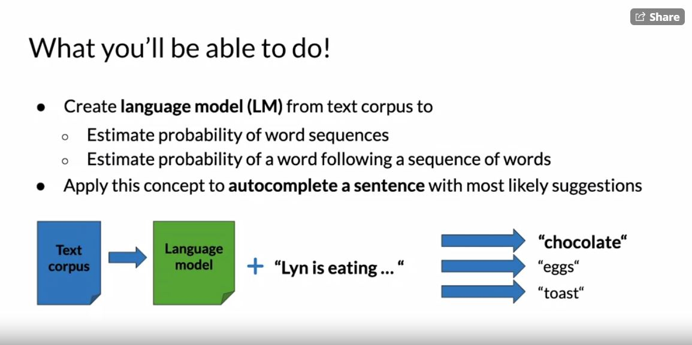
Language models can be used in different cases:
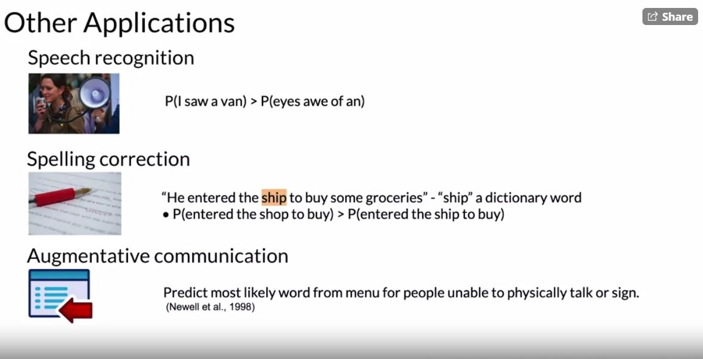

### What is an N-Gram?
N-Gram is a sequence of N words. Given a sentence, we can generate Unigrams, Bigrams, and Trigrams which are combinations of one, two, three words next to each other in the same order as the sentence.
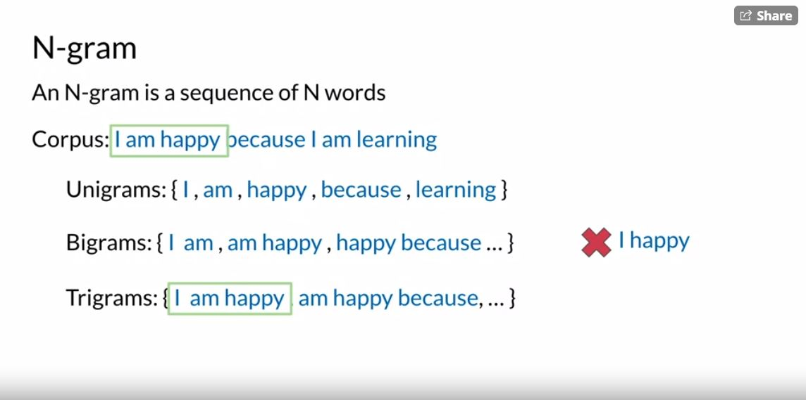
We can also have sequences with more than three words. Here is how we show them:
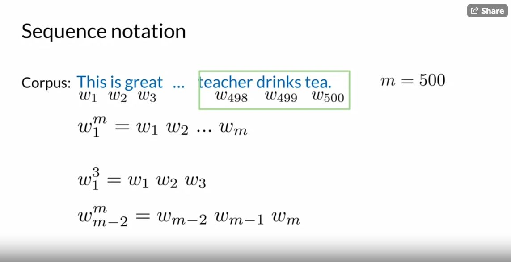
Here is how we calculate the probability of each unigram:
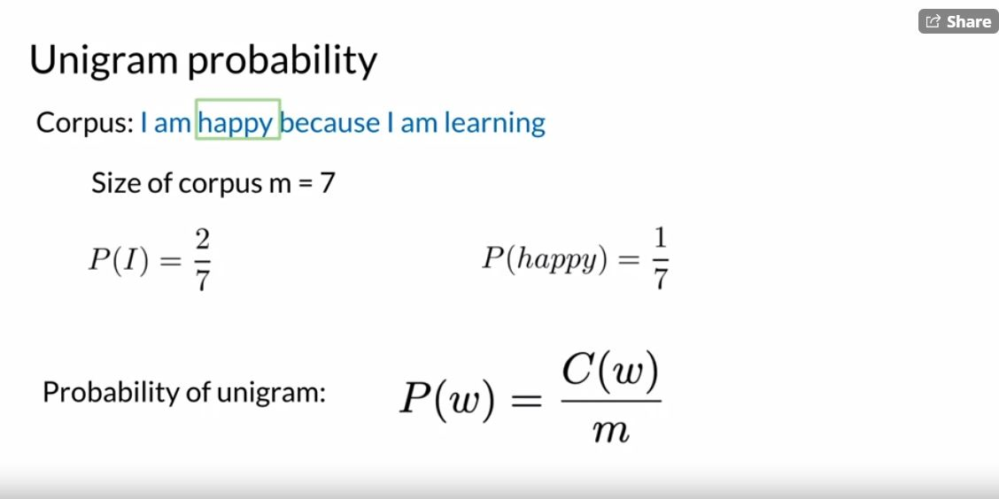
For calculating the bigrams probability, we can say the probability of  a word to be "am" given the previous word as "I" is the count of times where "I am" repeated in the corpus, divided by count of times where "I" occurred.
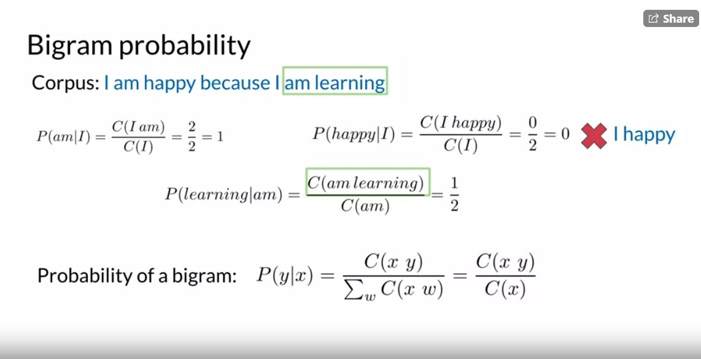
Similarly, we can calculate the trigrams' probability:
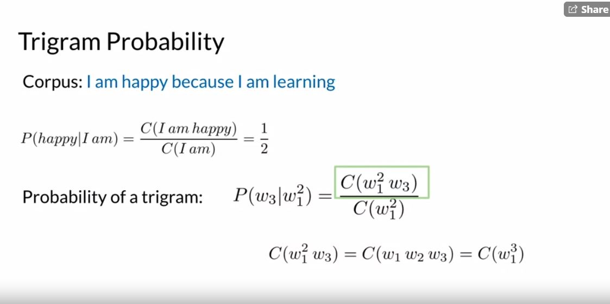


> Written with [StackEdit](https://stackedit.io/).