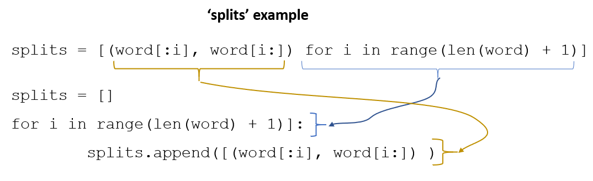

## Coursera NLP by deeplearning.ai

### Course 2: Natural Language Processing with Probabilistic Model:

What is autocorrect? An application that changes misspelled words into the correct ones. In this course we don't cover the words spelling correct but not being appropriate in the context. (e.g. Happy birthday my DEER friend, instead of DEAR friend.)

#### Four Steps of Auto Correction:
##### Step1: Identify the misspelled word: 
A misspelled word is a word which is not found in a dictionary. like this:
```python
if word not in vocab:
	misspelled = True
```
##### Step2: Find strings n edit-distance away: 
Find strings that are one, two, three, any number n edit distance away. Edit is an operation performed on a string to change it to another string. edit distance is the count of these operations. better definition is: n edit distance is how many operations needed from a string to be converted to another string. There are four edit types:
1- Insert: add a letter
2- Delete: remove a letter
3- Switch: swap two adjacent letters
4- Replace: change one letter to another
By having these steps and combining them, we find a list of possible strings that are n edits away.
##### Step3: Filter candidates:
Once we have the list of possible strings, we can filter them and keep the ones that are real and correctly spelled words.

##### Step4: Calculate word probabilities:
Finding the most likely words among the candidates. The probability of a words is calculated by dividing the word's frequency in the corpus to the total length of the corpus. For autocorrection we replace the misspelled word with the candidate with the highest probability.

#### The Lab:
- We added all the unique words to a list. When we want to add the frequency of each word, we can create a dictionary having a word and its count as each row of the dict. In order to do this, there is two ways:

First method:
```python
count_a = dict()
for w in words:
count_a[w] = counts_a.get(w,0) + 1
```
Second method:
```python
from collections import Counter
count_b = dict()
count_b = Counter(words)
```
**Numpy intersectld:** it finds the items existing in two numpy arrays:
```python
vocab = ['dean','deer','dear','fries','and','coke']
edits = list(deletes)

print('vocab : ', vocab)
print('edits : ', edits)

candidates=[]

### START CODE HERE ###
#candidates = ??  # hint: 'set.intersection'
import numpy as np
candidates = np.intersect1d(edits, vocab)
### END CODE HERE ###

print('candidate words : ', candidates)

>>> vocab :  ['dean', 'deer', 'dear', 'fries', 'and', 'coke']
edits :  ['earz', 'darz', 'derz', 'deaz', 'dear']
candidate words :  ['dear']
```

### Minimum Edit Distance:
This is a tool to find out how similar two words or strings are. Given two words or strings, minimum edit distance is the minimum number of operations needed to transform one string into another. use cases are: spelling correction, document similarity, and machine translation, DNA sequencing. 

For editing, we use three different operations:
1- Insert
2- Delete
3- Replace
for example for converting "play" to "stay" we need to replace "p" to "s" and "l" to "t". so the number of operations will be two. 
### Operation Cost:
For each type of operation we consider the cost of insert as 1, cost of delete 1, and cost of replace 2. like this:
{ "insert":1, "delete":1, "replace":2}

In finding the minimum edit distance, we are trying to minimize the cost, which is the sum of all operation costs.


### Algorithm:
We create a matrix where rows will be the source string and columns will be the target string.
We need to fill out a distance matrix (D) such that the distance matrix D[2,3] is the distance the beginning of the source to character 2, and from the beginning to character 3 in the target string.  We show it in python like this:
```python
D[2,3] = source[:2] -> target[:3]
or
D[i,j] = source[:i] -> target[:j]
```

In order to fill the matrix with all transformation costs per character, we start from the top left corner, and calculate for the smallest number of characters (# which is zero) then we add 1, then 2, etc. to till the end of it. calculating the diagonal numbers has three ways:
1- delete then insert
2- insert then delete
3- delete and insert at the same time
we can calculate the cost for each method and use the minimum of them as the final cost. then we add one more character and keep doing the same calculations. 


#### The formulaic approach:
after filling the first four cells on the top left corner, here is what we do for the rest of the cells:
1- **fillout the top and left edges:** we can use this formula:
```python
D[i,j] = D[i-1,j] + del_cost  # for the left column
D[i,j] = D[i, j-1] + ins_cost  # for the top row 
```
2- **calculate the rest of the cells:** the calculation is like this:
calculate the following three costs:

- D[i-1,j] + del_cost
- D[i,j-1] + ins_cost
- D[i-1,j-1] + rep_cost  // if the characters are the same, the replacement cost will be zero

Then find the minimum of them.


When we input all numbers and add heatmap effect to it, we see that from the middle of the matrix to the end, we don't need any change. so, the numbers will repeat without any cost being added to them. (the reason is in this example both words end with "ay"

This method is also called **Levennshtein.**

In order to program this, we use **Dynamic Programming** or **Recursive programming** which solves the problem for a small portion, then uses the result of it to calculate the next iterations.

### Assignment notes:
[THIS](https://norvig.com/spell-correct.html](https://norvig.com/spell-correct.html)) article has the whole code in Python.
following photo is a good review of list comprehension in Python.


the photo below shows how to write word splits in list comprehension.



> Written with [StackEdit](https://stackedit.io/).