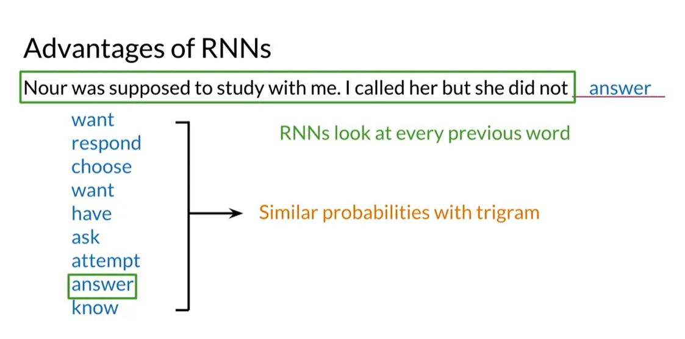

## Coursera NLP by deeplearning.ai

### Course 3: Natural Language Processing with Sequence Model:
 __Week1 -  Neural Networks for Sentiment Analysis:__
Neural Network is a computational method which tries to mimic the way human brains find patterns. NNT is a very powerful tool for AI applications.
Here is an example:

Then network above has an input layer, two hidden layers, and an three output units.
The input layer has n features ( predictors) we call them x as individuals but also can be shown as a vector of X with the size of n.
Here is how we move forward:
**a superscript i:** the ith computational layer. for example "a" superscript 0 is X. 
**z superscript i:** the calculation of the weighted values which is going to be used in the activation function later. the value can be achieved by the sum of W (weight matrix) of the current layer, multiplied by the "a" matrix of the previous layer.
**W superscript i:** The weight matrix of layer i
** g superscript i:** It is the activation function of layer i
Finally we get the values of layer i by passing z into the activation function g. 

Here is an example of a neural network being used in sentiment analysis:


In order to create the sentiment analysis in NNT, first we list all vocabulary in the corpus, then assign an integer to each, then replace the words in each tweet with their integer values, and at the end we add zeros to all tweets to make them as long as the longest tweet. This process is called **Padding.**

### Trax Library for NNT:
Trax is built on the top of Tensorflow and it's simple to use. Here is an example of how to build the architecture:


[Here](https://trax-ml.readthedocs.io/en/latest/) is the link to Trax documentation.
[Here](https://jax.readthedocs.io/en/latest/index.html "JAX") is the link to JAX documentation.

#### What is JAX?
Jax Trax uses TF as its backend engine, and also uses JAX to speed up the computations. JAX can be considered as an optimized version of Numpy and we even import the numpy from trax like this:
```python
import trax.fastmath.numpy as np
```
Another example is importing numpy.ndarray like this:
```python
jax.interpreters.xla.DeviceArray
```

### Dense vs ReLu:
Dense layer means when all nodes are fully connected to the neurons of the next layer.

ReLu layer typically follows a dense layer and transforms any negative values to zero before sending them on to the next layer.


### Serial Layer:
A composition of dense and activation layers (sublayers) that operate in a sequence to implement the forward propagation calculation. we can see it as having the whole model being compressed in one layer.


### Embedding Layer:
In NLP tasks we normally include an embedding layer which takes the vocabulary words with an index assigned to each, and maps it with a set of parameters in a determined dimension. Then we need to train the model to bring the best values for the embeddings to have the best performance. For the embedding layer we have a matrix of weights of size equal **(vocabulary size x embedding dimension)**.
The size of the embedding can be treated as a hyperparameter in the model, (parameters we manually add similar to learning rate)

### Mean Layer:
It simply comes after embedding layer, and calculates the mean of the embedding parameters for each word (row). for example if we have 4 vocabularies, and 100 embedding dimensions, the output of embedding output size is (4x100) and it feeds the mean layer and returns a vector of size 100. 


As a summary:
>Embedding is trainable using an embedding layer
>Mean layer gives a vector representation

### Training the NNT:
For training, we need to calculate the gradient (differential). Trax can do it simply as seen here:

to train the the model we use grad() method. This method takes two sets of parameters. First set is parameters for the grad function, the second set for the function returned by grad. Then all we need to do, is to iterate over grads and each time deduct the weights by the grad times learning rate (alpha) until we get the best convergence. We actually made forward and backward propagation in a single line of code.


### Notebook notes:
- There is new way of writing a loop that I didn't know. Instead of saying:
```python
[i for i in range(0,size(a))] # a is a list
```
We can simply say:
```python
[*range(size(a))]
```
- **Shuffling the examples for each epoch is known to reduce variance, making the models more general and overfit less.**

 __Week2 -  Natural Language Processing with Sequence Models:__
The traditional N-grams models need so much space and memory to calculate the probability of all combinations of words in order to calculate the probability of the whole sentence. Also, sometimes the dependency of two words which are far apart has to be calculated which takes a long sequence of calculations. 
Instead of the N-Grams which is so limited, we can use RNN (Recurrent Neural Networks) 
Below is an example that N-grams can return so many inappropriate words, whereas RNN can return a much closer answer.


RNN doesn't look at only the last few words, but it propagates the whole sentence and context no matter the length.


The magic of RNN is that the information of each word (Steps above) will be multiplied by the same weight matrix W to calculate the next step.

### Different Architectures for Differente AI Tasks:
**1- One to One:** If the model takes a set of low or non-correlated features X, and returns a single value of output y.

**2-One to Many:** When the model takes a single input, and generates a set of values. Caption generation is a good example:


**3-Many to One:**  When the model takes a set of input and returns a single values. like sentiment analysis:

**4-Many to Many:** When a model takes a set of input and returns a set of output, like machine translation.


### The Basic RNN:
For each word, we have to calculate the h (hidden state) which is calculated by using the activation function, with the parameters of h of the previous step, and x of the current step, dot product with the weight matrix plus the bias term (b). And having the h, and activation function, we can calculate the value of y hat (prediction)


Here is what happens to the first word, to calculate the hidden state (h) of the first word, and finally find y hat.


### Notes from the Notebook:


#### Joining (Concatenation): 
 A join along the vertical boundary is called a  _horizontal concatenation_  or  _horizontal stack_.

Visually, it looks like this:-  𝑊ℎ=[𝑊ℎℎ  |  𝑊ℎ𝑥]

In order to calculate the concatenation of two matrix, numpy has two functions:
```python
w_h1 = np.concatenate((w_hh, w_hx), axis=1)
w_h2 = np.hstack((w_hh, w_hx))
```
Joining along a horizontal boundary is called a vertical concatenation or vertical stack. Visually it looks like this:

For horizontal, similarly numpy has two functions:
```python
ax_1 = np.concatenate(
    (h_t_prev, x_t), axis=0)
ax_2 = np.vstack((h_t_prev, x_t))``
```

#### Cost Function for RNN:
Here is how we calculate the cost for each (x,y) pair.


In order to have the total cost calculated, we should calculate the average of all with respect to time. which means summation of all cost values at each timestamp, over the total cost (T)


#### How do we implement RNN in TensorFlow:
There is a function called scan() that takes a function, and implements it to all elements in a list.


#### Notebook Notes:
In numpy we can save an array as a .npy file. And here is how we load them:
```python
predictions = numpy.load('predictions.npy')
targets = numpy.load('targets.npy')
```
The targets is a 2d array, and the predictions are 3d (one more dimension for the size of the vocabulary used) Because the perplexity value is the summation of predictions x  targets, in order to calculate the perplexity (ppx), we need to convert the 2d targets into the same dimensions as the predictions, (we should convert each value to a one hot vector) like this:
```python
reshaped_targets = trax.layers.one_hot(targets, predictions.shape[-1]) 
#trax's one_hot function takes the input as one_hot(x, n_categories, dtype=optional)
```
predictions.shape[-1] returns the third dimension of the predictions (256)

### GRU (Gated Recurrent Units):
This type of model, has some parameters to allow us specify, how much information to forget from the past, and how much information to extract from the current input.

GRU uses relevance and updated gates, to remember only important prior information.


The architecture of the GRU unit is shown below:


GRU helps RNN with the problem of "Loss of relevant information for long sequences of words."

As a summary, GRU decides how to update the hidden state and it helps preserving important information.

GRU's are simple versions of LSTM models.

### BI-Directional RNN Architecture:
When the flow of the information can move from beginning to end and vice versa. Going backwards is like predicting now from the future.

In order to predict y hat, we should calculate both directions' hidden states, and use the formula below to get the value of y hat for each state:


### Deep RNN:
Deep RNN is similar to a regular deep neural network. They have a layer that saves the input sequence X, and multiple additional layers. They are just RNN's stacked together.

 
 __Week3 -  RNNs and Vanishing Gradients:__
RNN has two problems:
1- Struggles with longer sequences
2- Prone to vanishing or exploding gradients 
In RNN the first element or word of the sequence doesn't have so much effect on the final word or the output. The photo below shows how orange part relating to the first word, gets smaller and smaller:


[Here](https://blog.paperspace.com/intro-to-optimization-in-deep-learning-gradient-descent/) is a nice article about Gradient Descent concept.

### Notebook Notes:
The back prop presents a problem as the gradient of activation functions can be very small. Multiplied together across many layers, their product can be vanishingly small! This results in weights not being updated in the front layers and training not progressing.


- full explanation in this notebook: **C3_W3_Lecture_Notebook_Vanishing_Gradients**

The best solution for this problem, is LSTM architecture.

### LSTM Architecture:
LSTM is a powerful method that learns when to remember,  and when to forget. This way, LSTM can remember the entire sequence of data. LSTM loops back again after each epoch and it makes the gates to allow gradients to flow unchanged. Each hidden state has three gates.
Here is how the three gates work:


Below there are three gates:
1- it starts with the c on the right, then we have first gate which decides what to forget using sigmoid:


2 - second gate is input gate which decides what to store in the cell, using a sigmoid layer to choose what values to update, and a tanh layer to select for the new values to be added.


3- output gate that takes the previous results and uses another sigmoid and tanh layer to decide what to generate as the output.


Below we see some applicaitons of LSTM in real world:


[Here](https://colah.github.io/posts/2015-08-Understanding-LSTMs/) is  a good article about LSTM model. 

### Named Entity Recognition(NER):
A fast and efficient way to scan text for certain kinds of information.


this model can find entities such as geolocations, names of places, dates, etc. and other words will be tagged as filler words O:


NER has so many applications"


 __Week4 -  Natural Language Processing with Sequence Models:__

Now we can learn about another type of neural networks called "Siamese Networks" which consists of two identical neural networks which are merged at the end. This architecture has many applications in NLP.
This architecture, helps the system to find out sentences which have no words in common, but he meaning of them are the same, or vice versa. 


Siamese networks try to find the difference or similarity between two sentences considering their context and calculating a single similarity score.

This kind of applications are useful for example in search engines to find if queries are asked before but in different wordings? or even signatures similarity in a handwriting. 


> Written with [StackEdit](https://stackedit.io/).